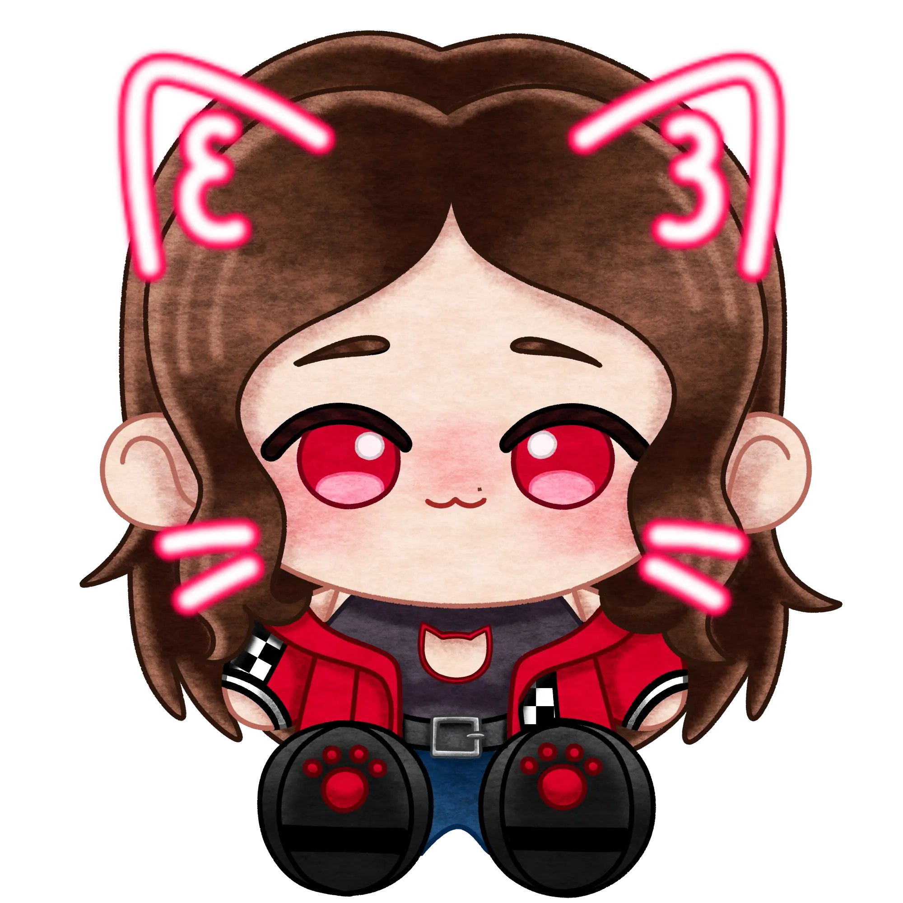

# 🎀 Lornychi | Portafolio de Streamer y Vtuber

Bienvenido al sitio web oficial de **Lornychi**, una streamer, Vtuber e ilustradora de Honduras 🇭🇳.  
Este portafolio fue creado para presentar su trabajo artístico, horarios de streams, comunidad y contenido multimedia de forma visual, dinámica y profesional.

<p align="center">
  
</p>

---

## 🌸 Características

- 💖 Página principal con presentación animada y avatar
- 📝 Sección "Sobre mí" con detalles personales
- ❓ Preguntas frecuentes (FAQ)
- 📅 Horario semanal de streams
- 🖥️ Información del setup de streaming
- 🔗 Acceso rápido a todas sus plataformas: Twitch, Discord, Ko-fi, Instagram, Twitter, YouTube, etc.
- 🎨 Galería dinámica de ilustraciones con carga aleatoria
- 🚀 Diseño responsivo con estilo kawaii y efecto gradiente

---

## 🛠️ Tecnologías utilizadas

- **[Astro](https://astro.build/)**: Framework moderno para sitios web rápidos y estáticos  
- **Tailwind CSS**: Para estilos rápidos, responsivos y personalizables  
- **JavaScript (ESM)**: Para manejar la galería de imágenes dinámicas  
- **Markdown + Frontmatter**: Para configuración y estructura general  
- **Vite + Vercel**: Para desarrollo rápido y despliegue inmediato

---

## 📂 Estructura del proyecto

```

/
├─ public/           # Imágenes y assets públicos (banner, avatar, ilustraciones)
├─ src/styles/       # Estilos globales (Tailwind)
├─ pages/index.astro # Página principal con secciones importadas
├─ components/       # (opcional) Componentes reutilizables si se modulariza

```

---

## 🧑‍🎨 Créditos

- 💡 Diseño y desarrollo por [@YourS4nty](https://instagram.com/YourS4nty)
- 🌸 Todo el contenido (arte, branding, streams) pertenece a [@Lornychi](https://twitch.tv/lornychi)

---

## 🛰️ Despliegue

Este sitio fue desplegado usando **[Vercel](https://vercel.com/)**.  
Puedes verlo en vivo aquí:  
🔗 **[https://lornychi.vercel.app/](https://lornychi.vercel.app/)**

---

## 📌 Nota

Este proyecto fue desarrollado como un portafolio personal para una creadora de contenido.  
No tiene fines comerciales, y está hecho con cariño, creatividad y respeto por su comunidad 💕

---
